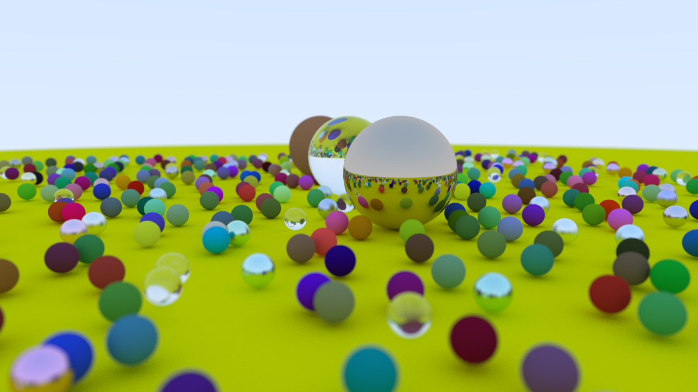

# PathTracer

**Note:** This project is built and test on Visual Studio 2022.

## Project Build Instruction
Follow the steps to build the project.
1. Clone the repository using the following command on the cmdline tool of your choice.

```
git clone https://github.com/zyoKo/CPU-Ray-Tracer.git
```

2. To create project files execute the ```script/generate-vs-files.bat```.

3. Build the project and run with command-line arguments ```*.exe > filename.ppm```. The filename extension should be ```.ppm``` as the format only support PPM Images as of now.

4. The PPM Image should be created in ```CPURayTracer/build``` folder. Use PPM Image viewer of your choice to view the image. 

## Project Description

### Final Render


### Focus Blur


### Materials


### Diffuse Reflection


### Anti-Aliasing


## Credits
Path Tracer made using PeterShirley Ray Tracing Framework.

